# Guide d'utilisation SIDSE IBDC (Piè Baromètre)

> **Plateforme :** SIDSE IBDC (Glazoué)
> **Source :** https://clean-doc-style.lovable.app
> **Format :** Markdown avec captures d'écran intégrées

`## Bienvenue sur SIDSE IBDC

*Guide d'utilisation*

Ce guide explique, étape par étape et avec des captures d'écran de la plateforme, comment utiliser SIDSE IBDC (Piè Baromètre) : les profils utilisateurs, la gestion des permissions et la gestion des comptes. D'autres sections (tableau de bord, PDC, ODD & indicateurs, projets phares…) viendront compléter ce document.

  

---

    
### [À propos] Ce que couvre ce guide

    
_SIDSE IBDC est la plateforme de suivi utilisée par la commune (ici illustrée avec l'exemple **Glazoué**) pour gérer le Plan de Développement Communal (PDC), les Objectifs de Développement Durable (ODD) et les indicateurs associés, ainsi que les projets phares. Chaque utilisateur y accède avec un compte associé à un **profil**, qui détermine ce qu'il peut voir et faire._

    
> 💡 **Comment lire ce guide**  
> Chaque section explique une action précise (ex. « changer le profil d'un utilisateur ») avec la marche à suivre numérotée et une capture d'écran réelle de la plateforme.

  

  

---

    
### [Comptes & accès] Les profils utilisateurs

    
_Chaque compte créé sur la plateforme se voit attribuer un profil parmi la liste ci-dessous. Le profil détermine les permissions accordées par défaut (voir la section « Permissions d'interface »), qui peuvent ensuite être ajustées individuellement pour chaque utilisateur._

    

    *📷 Liste des profils proposés lors de la création ou de la modification d'un compte utilisateur.*

    
**Profils et Rôles disponibles :**

Accès complet, y compris la gestion des utilisateurs.
      AdministrateurAccès complet aux modules métier, sans la gestion des utilisateurs.
      Administration-FinanceSocle commun + Suivi des PIT + Suivi financier.
      PersonnelSocle commun + Suivi des PIT.
      PartenaireSocle commun (tableau de bord décideur, PDC, indicateurs, rapports…).
      Partenaire / ONGOrganisation non gouvernementale associée à la commune. *(permissions à confirmer)*
      Bailleur / DonateurSocle commun — accès en consultation aux projets soutenus.
      Agent-CollecteurSocle commun — chargé de la collecte de données sur le terrain.
      Arrondissement de ChefsSocle commun — représentant au niveau de l'arrondissement.
      VUDSocle commun — profil lié au suivi urbain / développement.
      Ministère / PréfectureSocle commun — instance de tutelle départementale ou nationale.
    
    
> 💡 **Le détail complet**  
> Le détail module par module de chaque profil (« socle commun » et permissions supplémentaires) est expliqué et illustré dans la section <a href="#permissions-par-profil" style="color:inherit;">Permissions par défaut selon le profil</a>.

  

  

---

    
### [Administration] Comprendre les permissions d'interface

    
_En plus du profil général, chaque utilisateur peut avoir ses permissions ajustées individuellement, module par module. C'est ce que montre l'écran **« Permissions d'interface »**, accessible depuis la gestion des utilisateurs._

    

    *📷 Exemple : permissions du profil **Super Administrateur** — tous les modules sont activés.*

    
#### i. Comment lire cet écran

    
| Bloc de permissions | Contenu |
| --- | --- |
| Gestion du PDC | Tableau de bord, Tableau de bord décideur, Gestion de PDC, Éléments des indicateurs, Visualiser les indicateurs, Rapports, Nouveau PTA, Révision PTA, Suivi des PIT, Nouvelle évaluation, Recommandations, Suivi des recommandations, Calendrier budgétaire, Calendrier des évaluations, Structures municipales, Partenaires, Source de financement, Suivi financier, Statistiques. |
| ODD & Indicateurs | Liste des ODD, Liste des indicateurs, Faire une collecte, Paramètres ODD. |
| Projets Phares | Projets de tableau de bord, Projets, Secteurs, Collecte de données, Contrôle qualité. |
| Paramètres | Gestion des utilisateurs. |

    
1. **Chaque interrupteur (toggle)** correspond à un écran ou une fonctionnalité précise de la plateforme.
        
   > 💡 *Un interrupteur activé (violet) donne accès à cette fonctionnalité pour l'utilisateur concerné.*
2. **L'étiquette « Par défaut »** sous chaque permission indique qu'elle correspond au réglage standard du profil de l'utilisateur.
        
   > 💡 *Une permission modifiée manuellement n'affiche plus cette étiquette.*
3. **Le compteur en haut à droite de chaque bloc** (ex. « 19/19 ») indique le nombre de permissions activées sur le total du bloc.
4. **Bouton « Réinitialiser »** : ramène toutes les permissions du bloc aux réglages par défaut du profil.
5. **Bouton « Sauvegarder »** : enregistre les modifications apportées aux permissions de l'utilisateur.

    
#### i. Permissions par défaut selon le profil

    
_En observant les réglages « Par défaut » de plusieurs comptes, on retrouve un **socle commun** de permissions accordé à la majorité des profils, auquel s'ajoutent des permissions spécifiques pour certains d'entre eux._

    
> 💡 **Le socle commun (« base »)**  
> Tableau de bord décideur, Gestion de PDC, Visualiser les Indicateurs, Rapports (bloc Gestion du PDC) · Liste des indicateurs (bloc ODD & Indicateurs) · Projets de tableau de bord (bloc Projets Phares).

    
| Profil | Gestion du PDC | ODD & Indicateurs | Projets Phares | Gestion des utilisateurs |
| --- | --- | --- | --- | --- |
| Super Administrateur | 19/19 — tout | 4/4 — tout | 5/5 — tout | ✅ Oui |
| Administrateur | 19/19 — tout | 4/4 — tout | 5/5 — tout | ❌ Non |
| Administration‑Finance | 6/19 — socle + Suivi des PIT + Suivi financier | 1/4 — socle | 1/5 — socle | ❌ Non |
| Personnel | 5/19 — socle + Suivi des PIT | 1/4 — socle | 1/5 — socle | ❌ Non |
| Partenaire | 4/19 — socle | 1/4 — socle | 1/5 — socle | ❌ Non |
| Bailleur / Donateur | 4/19 — socle | 1/4 — socle | 1/5 — socle | ❌ Non |
| Ministère / Préfecture | 4/19 — socle | 1/4 — socle | 1/5 — socle | ❌ Non |
| VUD | 4/19 — socle | 1/4 — socle | 1/5 — socle | ❌ Non |
| Agent‑Collecteur | 4/19 — socle | 1/4 — socle | 1/5 — socle | ❌ Non |
| Arrondissement de Chefs | 4/19 — socle | 1/4 — socle | 1/5 — socle | ❌ Non |

    
> 💡 **À confirmer**  
> Le profil « Partenaire / ONG » n'a pas encore de capture d'écran dédiée — il sera ajouté dès que possible. Rappel : quel que soit le profil, l'administrateur peut toujours accorder ou retirer une permission individuellement (voir étape 5 ci-dessous).

    

    *📷 Profil **Administrateur** : accès à tous les modules métier, sauf « Gestion des utilisateurs ».*

    

    *📷 Profil **Administration‑Finance** : le socle commun, complété par « Suivi des PIT » et « Suivi financier ».*

    

    *📷 Profil **Personnel** : le socle commun, complété par « Suivi des PIT ».*

    

    *📷 Exemple du **socle commun** partagé par plusieurs profils (ici « Partenaire ») : Tableau de bord décideur, Gestion de PDC, Visualiser les Indicateurs, Rapports, Liste des indicateurs, Projets de tableau de bord.*

  

  

---

    
### [Administration] Gestion des utilisateurs

    
_C'est depuis cet écran que l'administrateur consulte, crée, modifie et gère les comptes de la plateforme._

    
#### 1. Voir la liste des utilisateurs

    

    *📷 Écran « Gestion des utilisateurs » : liste de tous les comptes de la commune.*

    
      
- ID, Nom, Prénoms, Contact, Email  : identité du compte.
- Profil  : rôle attribué à l'utilisateur (voir section « Profils utilisateurs »).
- Institution  : structure de rattachement (ex. la commune).
- Statut  : indique si le compte est  Activé  ou désactivé.
- Action  : icônes permettant de gérer le compte.
           
             🛡 Permissions  ⇄ Changer le profil  ✎ Modifier  🗑 Supprimer

    

    
#### 2. Rechercher ou filtrer un utilisateur

    
1. Utiliser le champ **« Nom, prénom ou email… »** pour rechercher un utilisateur précis.
2. Utiliser le menu déroulant **« Tous les profils »** pour n'afficher que les comptes d'un profil donné (ex. uniquement les « Personnel »).

    
#### 3. Créer un utilisateur

    
_La création d'un compte se fait en deux temps : la plateforme vérifie d'abord si l'adresse email existe déjà, puis propose soit de créer un nouveau compte, soit d'associer un compte existant à l'institution._

    
1. **Cliquer sur « + Créer un utilisateur »** en haut à droite de l'écran « Gestion des utilisateurs ».
2. **Étape 1 — Vérification :** saisir l'adresse email de la personne, puis cliquer sur **« Vérifier »**.
        
   > 💡 *La plateforme recherche si un compte existe déjà avec cet email.*

    

    *📷 Étape 1 : saisie de l'email et vérification de l'existence du compte.*

    
> 💡 **Deux cas de figure possibles**  
> Selon le résultat de la vérification, la fenêtre propose soit de créer un nouveau compte (aucun compte trouvé), soit d'associer un compte existant à l'institution (un compte existe déjà). Les deux cas sont détaillés ci-dessous.

    
#### 3a. Cas 1 — Aucun compte trouvé : créer un nouveau compte

    

    *📷 Aucun compte trouvé pour cet email : la plateforme invite à renseigner les informations du nouvel utilisateur.*

    
1. **Identité** : renseigner le **Nom** et les **Prénoms** de la personne.
2. **Contact** : renseigner le **Téléphone** (l'email saisi à l'étape précédente est déjà pré-rempli).

    

    *📷 Suite du formulaire : profil, langue, mot de passe et photo de profil.*

    
1. **Compte & Accès** : choisir le **Profil** de l'utilisateur (ex. Personnel, Administrateur…) et la **Langue** de l'interface.
2. Définir un **Mot de passe** et le confirmer dans le champ **« Confirmer le mot de passe »**.
3. Ajouter éventuellement une **Photo de profil** (facultatif).
4. Cliquer sur **« Créer l'utilisateur »** pour valider, ou sur **« Annuler »** pour abandonner.

    
#### 3b. Cas 2 — Un compte existe déjà : associer l'utilisateur

    

    *📷 Un compte existe déjà pour cet email : la plateforme affiche l'identité trouvée (« Utilisateur trouvé »).*

    
1. La fenêtre affiche le nom et l'email du compte déjà existant, avec l'indicateur d'étape passé à **« 2 Association »**.
2. Si le message **« Cet utilisateur est déjà associé à une institution »** apparaît, cela signifie que ce compte appartient déjà à une autre institution ; l'association à une nouvelle institution n'est alors pas proposée depuis cet écran.
3. Cliquer sur **« Annuler »** pour fermer la fenêtre dans ce cas.

    
#### 4. Changer le profil d'un utilisateur

    

    *📷 Fenêtre « Changer le profil », ouverte depuis la ligne d'un utilisateur.*

    
1. Dans la liste des utilisateurs, cliquer sur l'icône **⇄ (changer le profil)** sur la ligne de l'utilisateur concerné.
2. La fenêtre **« Changer le profil »** s'ouvre et affiche le nom et l'email du compte sélectionné.
3. Dans le champ **« Nouveau profil »**, choisir le profil souhaité dans la liste déroulante (Super Administrateur, Administrateur, Partenaire, Personnel, Arrondissement de chefs, Agent-collecteur, VUD, Ministère / Préfecture, Bailleur / Donateur, Partenaire / ONG, Administration-Finance).
4. Cliquer sur **« Enregistrer »** pour appliquer le nouveau profil, ou sur **« Annuler »** pour ne rien changer.

    
#### 5. Modifier les permissions d'un utilisateur

    
1. Dans la liste des utilisateurs, cliquer sur l'icône **🛡 (permissions)** sur la ligne de l'utilisateur concerné.
2. La page **« Permissions d'interface »** s'ouvre pour ce compte (voir la section dédiée ci-dessus pour le détail des blocs).
3. Activer ou désactiver les permissions souhaitées, puis cliquer sur **« Sauvegarder »**.

  

  

---

    
### [Module PDC] Accéder aux modules de la plateforme

    
_Après connexion, la page d'accueil de l'institution (ici la commune de Glazoué) présente les **modules** disponibles : PDC, ODD, Projet Phare, et Gestion des paramètres de comptes. C'est le point de départ pour accéder au module de gestion du Plan de Développement Communal._

    

    *📷 Espace de travail : choix du module à ouvrir (PDC, ODD, Projet Phare, Paramètres).*

    
1. Cliquer sur **« Accéder au module »** sous la carte **« Plan de Développement Communal (PDC) »** pour entrer dans le module PDC.
2. Le menu latéral de gauche s'affiche alors avec toutes les sections du module : Tableau de bord, Tableau de bord décideur, Gestion de PDC, Éléments des Indicateurs, Visualiser les Indicateurs, Rapports, ainsi que la Gestion de PTA et de PIT.

  

  

---

    
### [Module PDC] Tableau de bord PDC

    
_Vue d'ensemble de l'avancement du Plan de Développement Communal : projets actifs, taux d'exécution, budget consommé, partenaires actifs, ainsi que le suivi du PTA (Plan de Travail Annuel) en cours._

    

    *📷 Tableau de bord PDC : indicateurs clés, informations PTA, projets en cours et activités récentes.*

    
      
- Cartes du haut  : Projets PDC actifs, Taux d'exécution, Budget consommé, Partenaires actifs.
- Portée temporelle  et  Vision  : rappellent la période couverte par le PDC et sa vision stratégique.
- Filtres Année / Trimestre  : permettent d'affiner les chiffres affichés sur une période précise (bouton « Réinitialiser » pour revenir à la vue globale).
- Informations PTA  : montant du PTA, montant exécuté, date de dernière révision, prochaine évaluation, et nombre d'activités en retard.
- Niveau de mise en œuvre  : compare la prévision, la réalisation et le taux à date.
- Projets en cours  et  Activités récentes  : suivi visuel de l'avancement de chaque projet et journal des dernières actions.

    
  

  

---

    
### [Module PDC] Tableau de bord Décideurs

    
_Vue simplifiée destinée aux décideurs, avec des filtres de recherche pour cibler un PDC, une année ou un PTA précis, et des raccourcis vers les documents stratégiques._

    

    *📷 Tableau de bord Décideurs : filtres de recherche, informations PTA et accès rapide.*

    
1. **Filtres de recherche** : choisir un PDC, une année, un PTA et une date de référence, puis cliquer sur **« Rechercher »**.
2. **Informations PTA** : montant, montant exécuté, dernière révision, prochaine évaluation (affiche « N/A » tant qu'aucun PDC/PTA n'est sélectionné).
3. **Activités en retard** : cliquer sur cette carte pour voir le détail (voir section « Activités en retard » ci-dessous).
4. **Accès rapide** : liens directs vers le **Document de Plan TBS** (Tableau de Bord Stratégique) et le module **ODD**.

  

  

---

    
### [Module PDC] Gestion des PDC

    
_Écran de gestion des Plans de Développement Communaux eux-mêmes : création, recherche et export de la liste des PDC de l'institution._

    

    *📷 Liste des PDC de l'institution, avec recherche par code ou libellé.*

    
1. Utiliser le champ **« Rechercher par code ou libellé… »** pour retrouver un PDC existant.
2. Cliquer sur **« + Nouveau PDC »** pour créer un nouveau plan de développement communal.
3. Cliquer sur **« Exportateur »** pour exporter la liste affichée.
4. Le tableau affiche pour chaque PDC : ID, Code, Libellé, Description, dates de Début/Fin et le fichier associé.

    
> 💡 **Capture à venir**  
> Le détail du formulaire de création d'un nouveau PDC (« + Nouveau PDC ») sera ajouté dès qu'une capture de cet écran sera disponible.

  

  

---

    
### [Module PDC] Éléments des Indicateurs

    
_Ce hub regroupe les trois outils permettant de définir, planifier et suivre les indicateurs de performance d'un PDC._

    

    *📷 Trois modules accessibles : Gestion, Planification et Collecte de données.*

    
#### 1. Gestion des indicateurs

    

    *📷 Créer, modifier et supprimer les indicateurs de performance.*

    
1. Utiliser les filtres **Recherche, PDC, Activité, Statut, Type proxy, ODD, Cible ODD** pour retrouver un indicateur précis, puis cliquer sur **« Rechercher »**.
2. Cliquer sur **« + Nouvel Indicateur »** pour créer un indicateur.
3. Le tableau affiche : ID, PDC, Activité, Indicateur, Valeur de référence, Valeur cible, Date référence, Date cible, Statut.

    
#### 2. Planification des indicateurs

    

    *📷 Définir les valeurs cibles annuelles pour chaque indicateur du PDC.*

    
1. Filtrer par **PDC, Activité, Indicateur, Année**, puis cliquer sur **« Rechercher »**.
2. Cliquer sur **« + Nouvelle Planification »** pour définir une nouvelle valeur cible annuelle.
3. Le tableau affiche : ID, Indicateur, Valeur cible, Année, Statut.

    
#### 3. Collecte de données

    

    *📷 Trois actions possibles : nouvelle collecte, données rejetées, validation.*

    
1. **Nouvelle collection** : saisir de nouvelles données d'indicateurs, avec statut soumettre/valider.
2. **Données rejetées** : gérer les données rejetées, avec possibilité de les soumettre à nouveau.
3. **Validation** : valider ou rejeter les données soumises par les collecteurs.

    

    *📷 Écran « Collecte de Données » : filtrer par PDC, activité, indicateur, année, ou lancer une nouvelle collecte via « + Nouvelle Collection ».*

    

    *📷 « Données validées » : liste des collectes déjà validées, avec les mêmes filtres et un export possible.*

    

    *📷 « Données rejetées à corriger » : les collectes renvoyées pour correction avant nouvelle soumission.*

    
#### 4. Visualiser les indicateurs

    

    *📷 Analyse graphique des indicateurs d'un PDC.*

    
1. Choisir un **PDC** dans la liste déroulante.
2. Filtrer éventuellement par **Année**.
3. La liste des indicateurs disponibles pour ce PDC s'affiche alors ; cliquer sur un indicateur pour voir son graphique d'évolution.

  

  

---

    
### [Module PDC] Objectifs de Développement Durable (ODD)

    
_Cette page présente les 17 Objectifs de Développement Durable des Nations Unies, utilisés pour classer les indicateurs et les projets de la commune._

    

    *📷 Les 17 ODD affichés sous forme de grille cliquable.*

    
1. Cliquer sur un **objectif (ODD)** pour voir le détail de ses cibles et de ses indicateurs proxy associés.
2. Le compteur en haut à droite (**« 17 objectifs »**) confirme que l'ensemble des ODD officiels est chargé.

  

  

---

    
### [Module PDC] Activités en retard

    
_Liste des activités du PTA qui n'ont eu aucune tâche exécutée sur la période d'évaluation en cours — accessible directement depuis le Tableau de bord Décideurs._

    

    *📷 Écran « Activités en Retard », avec filtres PDC / Année / PTA / recherche par nom ou code.*

    
1. Depuis le **Tableau de bord Décideurs**, cliquer sur la carte **« Activités en retard »**.
2. Utiliser les filtres **PDC, Année, PTA** ou la recherche par **nom ou code d'activité** pour cibler une activité précise.
3. Le tableau affiche : Code, Activité, PTA, Piste de la firme, Structures associées, Tâches totales, Tâches non exécutées.

  

  

---

    
### [Module PDC] Structure & Finance

    
_Ce groupe du menu latéral regroupe les référentiels utilisés dans tout le PDC : l'organigramme de la mairie, les partenaires impliqués et les sources de financement des projets._

    
#### 1. Structures municipales

    

    *📷 Gérer les structures de la mairie (organigramme).*

    
1. Filtrer par **Statut** ou **Parent de structure** pour retrouver une structure dans la hiérarchie.
2. Cliquer sur **« + Nouvelle Structure »** pour ajouter une structure municipale.
3. Le tableau affiche : ID, Sigle, Structure, Parent de structure, Statut.

    
#### 2. Partenaires

    

    *📷 Gérer les partenaires du projet, avec indicateurs (total, actifs, types distincts).*

    
1. Filtrer par **Type** ou **Statut**, ou rechercher par **Nom ou sigle**.
2. Cliquer sur **« + Nouveau Partenaire »** pour ajouter un partenaire.
3. Le tableau affiche : ID, Date, Logo, Sigle, Partenaire, Type, Statut.

    
#### 3. Sources de financement

    

    *📷 Gérer les sources de financement des projets.*

    
1. Filtrer par **Partenaire** ou **Statut**, ou rechercher une source.
2. Cliquer sur **« + Nouvelle Source »** pour ajouter une source de financement.
3. Le tableau affiche : ID, Date, Partenaire, Source, Statut.

  

  

---

    
### [Module PDC] Gestion des PTA, des PIT et des évaluations

    
_Le PTA (Plan de Travail Annuel) décline le PDC en actions annuelles ; le PIT (Plan Individuel de Travail) en assure le suivi individuel ; les évaluations mesurent enfin le niveau de réalisation de l'un et de l'autre._

    
#### 1. Gestion des PTA — créer un nouveau PTA

    

    *📷 Liste des Plans de Travail Annuels de l'institution.*

    
1. Filtrer par **PDC** ou rechercher un PTA, puis cliquer sur **« + Nouveau PTA »** pour en créer un.

    

    *📷 Étape « Planification » : PDC associé et année du PTA, puis période d'exécution.*

    
1. **Planification** : choisir le **PDC associé** et l'**Année du PTA**.
2. **Période d'exécution** : renseigner la **Date de début** et la **Date de fin**.

    

    *📷 Suite du formulaire : statut et documents joints.*

    
1. **Configuration** : définir le **Statut** du PTA (ex. « Activé »).
2. **Documents** : ajouter une **Observation** ou un commentaire, et joindre un fichier si besoin.
3. Cliquer sur **« Enregistrer »** pour valider la création du PTA.

    
#### 2. Révisions PTA

    

    *📷 Gestion et suivi des révisions de Plans de Travail Annuels.*

    
1. Sélectionner un **PDC** et une **année** pour afficher les révisions disponibles.
2. Cliquer sur **« + Nouveau PTA »** si une révision nécessite la création d'un nouveau plan.

    
#### 3. Suivi des PIT

    

    *📷 Gestion et consultation des évaluations PIT (Plan Individuel de Travail).*

    
1. Rechercher un PIT, ou filtrer par **PDC** et **Année**.
2. Le tableau affiche : ID, PTA, Année, Date début, Date de fin, Statut, Actions.

    
#### 4. Nouvelle évaluation

    

    *📷 Liste des évaluations de Plans de Travail : choisir un PDC puis une année pour afficher les évaluations existantes.*

    
1. Sélectionner un **PDC**, puis une **année**, pour voir les évaluations disponibles.
2. Cliquer sur **« + Nouvelle Évaluation »** pour en créer une.

    

    *📷 Formulaire « Nouvelle évaluation » : PDC, PTA associé, période et statut.*

    
1. **Planification** : choisir le **PDC** puis le **PTA associé**.
2. **Période** : renseigner la **Date de début** et la **Date de fin** de l'évaluation.
3. **Configuration** : définir le **Statut**, puis cliquer sur **« Enregistrer »**.

    
#### 5. Rapports & Évaluations

    

    *📷 Le hub « Rapports » regroupe 6 modules d'analyse du PDC.*

    
      
- Évaluation de PIT  : analyse du niveau de réalisation du Plan de Travail Individuel.
- Évaluation de PTA  : analyse du niveau de réalisation du Plan de Travail Annuel.
- Évaluation de PDC  : analyse du niveau de mise en œuvre et des résultats du Plan de Développement Communal.
- Projection financière  : estimation prévisionnelle des ressources financières par source de financement.
- Visualisation de PTA  : le Plan de Travail Annuel sous forme de tableau détaillé.
- Synthèse Évaluation  : vue d'ensemble consolidée des indicateurs d'évaluation (budget, TEP, activités en retard, dates clés).

    

    

    *📷 Évaluation de PTA : tâches totales, terminées, en cours, en retard, avec filtres de recherche détaillés (PDC, année, PTA, trimestre, structure…).*

    

    *📷 Évaluation de PIT : même principe que l'évaluation de PTA, au niveau individuel.*

    

    *📷 Visualisation de PTA : liste détaillée des tâches du PTA avec taux d'exécution et suivi financier (TEF mandaté / engagé / décaissé).*

    

    *📷 Synthèse Évaluation : vue consolidée par niveau hiérarchique (Programme, Projet, Action, Activité) — TEP physique & TEF financier.*

    
1. Depuis chaque écran de rapport, définir les **filtres de recherche** souhaités puis cliquer sur **« Rechercher »**.
2. Utiliser le bouton **« Exportateur »** pour exporter les résultats lorsque disponible.

  

  

---

### [Module ODD] Accéder au module ODD

_Le module **Objectifs de Développement Durable (ODD)** de SIDSE IBDC offre aux collectivités un cadre méthodologique et opérationnel complet pour intégrer, suivre et évaluer l'alignement des politiques locales avec les 17 ODD des Nations Unies._

*📷 Espace de travail communal : carte du module « Objectif de Développement Durable (ODD) » avec badge « Disponible » et bouton d'accès direct.*

1. Depuis l'espace d'accueil de la plateforme (espace de travail), localiser la carte violette **« Objectif de Développement Durable (ODD) »**.
2. Vérifier le badge vert **« Disponible »**.
3. Cliquer sur le bouton **« Accéder au module → »** au bas de la carte.

Dès l'ouverture du module, l'interface s'ouvre par défaut sur l'écran **Liste des ODD** avec le menu de navigation complet à gauche :

*📷 Interface principale du module ODD : menu de navigation latéral à gauche et écran d'accueil « Liste des ODD » au centre.*

> 💡 **Basculer d'un module à un autre**  
> Vous pouvez à tout moment changer de module sans repasser par la page d'accueil en cliquant sur le sélecteur situé en haut à droite de l'en-tête (affichant « ODD », « PDC », « PROJET », « PARAMÈTRE »…).

---

### [Module ODD] Liste des ODD

_L'écran **Liste des ODD** centralise l'ensemble des Objectifs de Développement Durable intégrés à la plateforme SIDSE IBDC pour la collectivité (ici illustrée avec les 9 ODD de la commune de Glazoué). Il permet de visualiser rapidement les priorités territoriales et d'accéder aux cibles et indicateurs associés._

1. **Filtrer via le menu déroulant :** cliquez sur **« FILTRER : Tous les ODD »** pour isoler un objectif particulier.

*📷 Menu déroulant « FILTRER : Tous les ODD » — la flèche rouge indique l'outil de sélection pour cibler directement un ODD dans la liste.*

2. **Rechercher par mot-clé :** saisissez un terme dans la barre **« RECHERCHE »** pour filtrer instantanément les cartes.

*📷 Champ « RECHERCHE : Rechercher un ODD... » — la flèche rouge met en évidence la barre de recherche textuelle.*

3. **Consulter les cibles et indicateurs :** cliquez sur le lien **« Voir les cibles & indicateurs → »** au bas d'une carte d'ODD pour ouvrir sa fiche détaillée.

*📷 Lien « Voir les cibles & indicateurs → » — la flèche rouge désigne l'accès direct aux cibles et indicateurs de l'ODD sélectionné.*

> 💡 **Que faire ensuite ?**  
> Pour découvrir comment analyser et ouvrir le détail des cibles rattachées à un ODD, consultez la section **Détail d'un ODD & cibles**.

---

### [Module ODD] Détail d'un ODD & cibles

_En cliquant sur **« Voir les cibles & indicateurs → »** depuis une carte d'ODD, vous accédez à la fiche descriptive de l'objectif et à la liste des cibles prioritaires souscrites par la commune._

1. **Consulter la fiche de l'ODD et les cibles souscrites :**
   - Visualisez en haut de l'écran le libellé officiel de l'objectif (ex. *ÉGALITÉ ENTRE LES SEXES*) ainsi que son logo officiel.
   - Parcourez la section **« Toutes les cibles de l'ODD »** qui récapitule les cibles souscrites pour cet objectif.

2. **Accéder au détail d'une cible :**
   - Repérez la cible souhaitée dans le tableau (ex. *5.5 - Garantir la participation entière et effective des femmes...*).
   - Dans la colonne **Action**, cliquez sur le bouton **« 👁 ouvrir »** (mis en évidence par la flèche rouge) pour afficher la fiche détaillée de la cible et ses indicateurs de suivi.

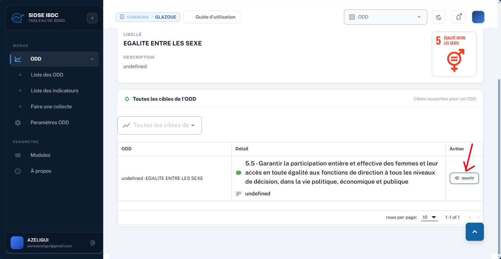

*📷 Écran « Détail ODD » — la flèche rouge indique l'emplacement du bouton « 👁 ouvrir » dans la colonne Action pour afficher le détail de la cible.*

> 💡 **Que faire ensuite ?**  
> Pour découvrir la fiche détaillée d'une cible et ses indicateurs de mesure, consultez la section **Détail d'une cible ODD & ses indicateurs**.

---

### [Module ODD] Détail d'une cible ODD

_Accessible après avoir cliqué sur **« 👁 ouvrir »** depuis le tableau des cibles, l'écran **Détail Cible** présente l'énoncé complet de la cible retenue ainsi que les indicateurs opérationnels chargés de mesurer son niveau d'atteinte._

1. **Consulter les spécifications de la cible :**
   - **Fil d'Ariane et retour :** visualisez la position hiérarchique (`Liste des ODD • Détail ODD • Détail Cible`) ou utilisez le bouton **« ← Retour »** pour remonter d'un niveau.
   - **Libellé de la cible :** lisez l'énoncé complet définissant la finalité poursuivie (ex. *« Garantir la participation entière et effective des femmes et leur accès en toute égalité aux fonctions de direction... »*).

2. **Examiner les indicateurs de suivi rattachés :**
   - **Tableau des indicateurs :** parcourez la section **« Tous les indicateurs de la cible »** listant chaque indicateur opérationnel avec son code (ex. *5.5.3*, *5.5.6*).
   - **Périodicité de collecte :** vérifiez la fréquence de renseignement des données sur le terrain (ex. *trimestriel*).

*📷 Écran « Détail Cible » — énoncé officiel de la cible et liste des indicateurs de suivi avec périodicité de collecte trimestrielle.*

> 💡 **Que faire ensuite ?**  
> Pour consulter l'ensemble des indicateurs de la commune toutes cibles confondues, accédez à la section **Liste des indicateurs ODD**.

---

### [Module ODD] Liste des indicateurs ODD

_Accessible depuis le menu latéral via l'onglet **« Liste des indicateurs »**, cet écran centralise l'ensemble des indicateurs ODD souscrits par la collectivité (16 indicateurs actifs à Glazoué)._

1. **Consulter le répertoire des indicateurs :**
   - **Accéder à l'écran :** cliquez sur **« Liste des indicateurs »** dans le menu latéral sous le module ODD.
   - **Tableau récapitulatif :** consultez les colonnes **ODD**, **Cible**, **Indicateur** (code et intitulé) et **Périodicité de collecte** (ex. *trimestriel*).

*📷 Écran « Liste des indicateurs » — répertoire des indicateurs souscrits pour la collectivité.*

2. **Lancer la visualisation d'un indicateur :**
   - Dans la colonne **Visualisation** (désignée par la flèche rouge), repérez les boutons d'action disponibles pour chaque indicateur.
   - Cliquez sur **« ⟳ Histogramme »** pour afficher l'évolution graphique ou sur **« ⟳ Tableau »** pour afficher la table de données chiffrées.

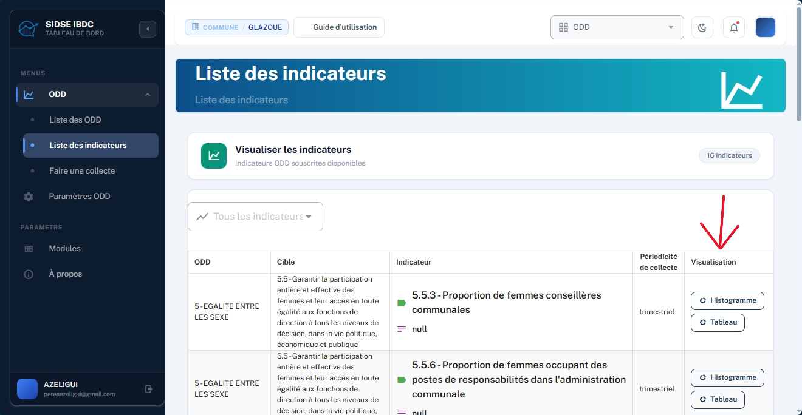

*📷 Colonne « Visualisation » — la flèche rouge désigne les boutons « Histogramme » et « Tableau » pour analyser les mesures collectées.*

> 💡 **Que faire ensuite ?**  
> Pour découvrir l'écran d'analyse graphique et tabulaire, consultez la section **Visualisation graphique & tabulaire**.

---

### [Module ODD] Visualisation graphique & tabulaire

_Accessible en cliquant sur **« Histogramme »** ou **« Tableau »** depuis la liste des indicateurs, cette interface permet d'explorer les données collectées sous forme de graphique ou de tableau chiffré._

1. **Consulter l'évolution graphique de l'indicateur :**
   - **Affichage de l'histogramme :** la vue graphique s'affiche avec l'intitulé de l'indicateur (ex. *5.5.3 Proportion de femmes conseillères communales*).
   - **Filtrer par période :** sélectionnez l'année souhaitée dans le menu déroulant **« Filtre par période »** (ex. *2022*) pour afficher les données correspondantes.

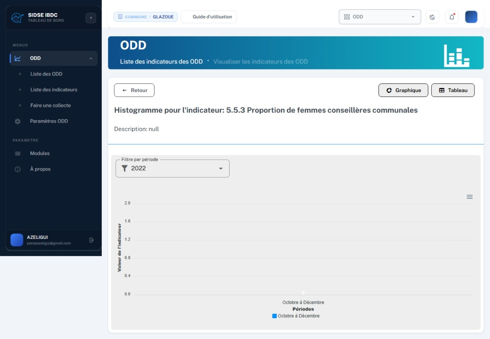

*📷 Écran « Visualisation » — affichage de l'histogramme par période avec filtre annuel.*

2. **Basculer vers la vue tabulaire :**
   - En haut à droite de l'écran, repérez le sélecteur d'affichage composé des boutons **« Graphique »** et **« Tableau »**.
   - Cliquez sur le bouton **« Tableau »** (indiqué par la flèche rouge) pour afficher les données sous forme tabulaire.
   - Pour revenir à la liste des indicateurs, cliquez sur le bouton **« ← Retour »** situé en haut à gauche.

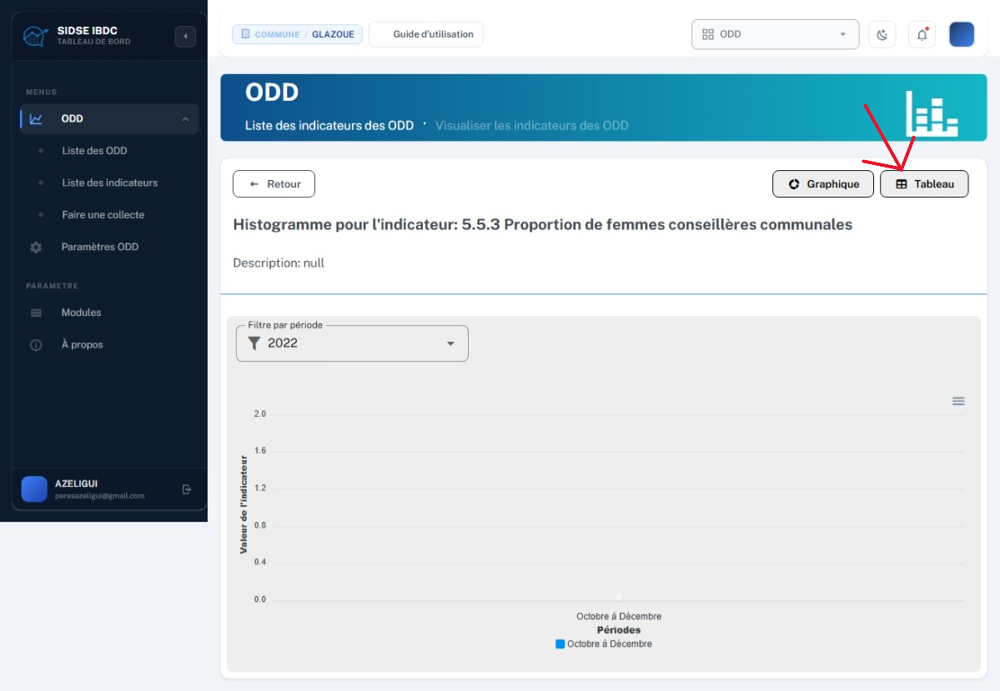

*📷 Bascule d'affichage — la flèche rouge met en évidence le bouton « Tableau » pour passer de la vue graphique à la vue tabulaire.*

> 💡 **Que faire ensuite ?**  
> Pour renseigner de nouvelles mesures sur le terrain, accédez à la section **Collecte de données ODD**.

---

### [Module ODD] Collecte de données ODD

_Accessible via **« Faire une collecte »** dans le menu latéral, cet écran centralise l'historique complet des données terrain relevées pour renseigner les indicateurs._

*📷 Écran « Liste des collectes » : historique des 15 collectes enregistrées avec filtres multicritères et statut validé.*

1. **Bouton d'ajout :** bouton bleu **« + Nouvelle collecte »** en haut à droite pour consigner une nouvelle mesure.
2. **Filtres multicritères :** filtrage combinable par **ODD**, par **CIBLE** et par **INDICATEUR**.
3. **Historique des collectes :** tableau affichant la date, l'ODD, la cible, l'indicateur, la région/commune (*GLAZOUE*), l'année (*2022*), la période (*Octobre à Décembre*) et la valeur mesurée.
4. **Statut :** badge vert **« Valider »** confirmant la validation officielle de la donnée.

---

### [Module ODD] Créer une nouvelle collecte

_L'enregistrement d'une nouvelle mesure s'effectue via un formulaire modal rapide et guidé._

*📷 Boîte de dialogue « Nouvelle collecte » : formulaire de saisie guidée avec sélection de l'indicateur, période et année.*

1. Depuis la liste des collectes, cliquer sur **« + Nouvelle collecte »**.
2. **Liste des indicateurs :** sélectionner l'indicateur concerné dans le menu déroulant.
3. **Période (« Period ») :** choisir la tranche temporelle (ex. *Octobre à Décembre*).
4. **Année :** saisir l'année de référence (ex. *2025* ou *2026*).
5. **Commune :** vérifier l'attribution à la collectivité (*GLAZOUE*).
6. Cliquer sur le bouton bleu **« Enregistrer »** pour consigner la donnée (ou **« Fermer »** pour annuler).

---

### [Module ODD] Paramètres ODD : Espace d'administration

_Accessible via l'entrée **« Paramètres ODD »** du menu latéral, ce hub d'administration permet de configurer et d'adapter le cadre ODD aux spécificités locales._

*📷 Espace « Paramètres ODD » : cartes d'accès à la reformulation des cibles et à la gestion des indicateurs.*

1. **Paramètres Cibles (REFORMULATION) :** adapter les libellés des cibles ODD internationales au contexte et aux compétences de la collectivité. Cliquer sur **« → Gérer »**.
2. **Paramètres Indicateurs (CRÉATION ET REFORMULATION) :** reformuler les indicateurs existants ou créer de nouveaux indicateurs personnalisés (*Indicateurs ODD Extra*). Cliquer sur **« → Gérer »**.

---

### [Module ODD] Paramètres des cibles (Reformulation)

_L'interface Paramètres cible permet d'adapter les énoncés des cibles souscrites sans rompre leur rattachement avec les cibles officielles de l'ONU._

*📷 Écran « Paramètres ODD • Paramètres cible » : liste des cibles souscrites et déclenchement de l'action « ✎ Reformuler ».*

1. Parcourir le tableau des cibles souscrites (11 cibles) avec le filtre **« Toutes les cibles de... »**.
2. Dans la colonne *Action*, cliquer sur le menu à trois points verticaux **⋮**.
3. Sélectionner l'action **« ✎ Reformuler »** dans le menu contextuel.
4. Renseigner le libellé contextualisé et valider : la nouvelle formulation s'applique à l'ensemble des écrans et rapports de la plateforme.

---

### [Module ODD] Paramètres des indicateurs & Indicateurs ODD Extra

_Cet écran combine la personnalisation des indicateurs du socle ODD et la création libre de métriques communales spécifiques._

*📷 Écran « Paramètres ODD • Paramètres indicateurs » : reformulation des indicateurs standards et section « Mes indicateurs ODD Extra » avec bouton « + Ajouter ».*

1. **Les indicateurs des ODD :** tableau des 16 indicateurs standards souscrits avec action **« ✎ Reformuler »** via le menu contextuel **⋮**.
2. **Mes indicateurs ODD Extra :** section inférieure dédiée aux métriques locales créées sur mesure par la commune.
3. Cliquer sur le bouton bleu **« + Ajouter »** pour déclarer un nouvel indicateur Extra (cible de rattachement, intitulé communal, unité, périodicité).
4. Après enregistrement, l'indicateur Extra est immédiatement disponible dans le formulaire de collecte et les tableaux de bord.

---

### [Module Projets Phares] Accéder au module Projets Phares

_Le module **Projet Phare** centralise la planification, le suivi opérationnel et l'évaluation continue des investissements et chantiers stratégiques portés par la municipalité._

*📷 Espace d'accueil communal : carte d'accès au module « Projet Phare » avec badge « Disponible ».*

1. Depuis le tableau de bord d'accueil de la collectivité, repérer la carte marron/orangée intitulée **« Projet Phare »**.
2. Vérifier la présence du badge vert **« ✔ Disponible »** attestant de l'activation du module pour votre commune.
3. Cliquer sur le bouton **« Accéder au module → »** au bas de la carte.

Dès l'ouverture du module, l'interface s'ouvre par défaut sur le **Dashboard (Visualisation d'indicateurs)** avec le menu de navigation complet à gauche :

*📷 Interface principale du module Projet Phare : menu de navigation latéral à gauche et écran d'accueil « Dashboard • Visualisation d'indicateurs » au centre.*

> 💡 **Basculer d'un module à un autre**  
> Vous pouvez à tout moment changer de module sans repasser par la page d'accueil en cliquant sur le sélecteur situé en haut à droite de l'en-tête (affichant « PROJET », « ODD », « PDC », « PARAMÈTRE »…).

---

### [Module Projets Phares] Dashboard & Indicateurs

_Le tableau de bord du module Projets Phares offre une vue consolidée et interactive des performances atteintes par chaque investissement communal selon les indicateurs et périodes retenus. Il permet de suivre l'évolution des métriques, de filtrer par projet stratégique et de rechercher rapidement un indicateur clé._

1. **Consulter le volume d'indicateurs :** repérez le badge compteur situé en haut à droite de la carte *« Visualisation des Indicateurs »* (ex. *0 indicateurs*).

*📷 Carte « Visualisation des Indicateurs » — la flèche rouge désigne le badge compteur qui affiche le nombre total d'indicateurs configurés pour la collectivité.*

2. **Filtrer par projet :** utilisez le menu déroulant **« FILTRER PAR PROJET »** pour isoler les indicateurs d'un chantier stratégique particulier.

*📷 Menu déroulant « FILTRER PAR PROJET » — la flèche rouge indique l'outil de sélection permettant d'isoler les indicateurs rattachés à un projet précis.*

3. **Rechercher un indicateur par mot-clé :** tapez un intitulé dans le champ **« RECHERCHE »** pour filtrer instantanément la liste.

*📷 Champ « RECHERCHE : Rechercher un indicateur... » — la flèche rouge met en valeur la barre de recherche textuelle instantanée.*

> 💡 **Que faire ensuite ?**  
> Pour consulter le répertoire complet des chantiers ou déclarer un nouveau projet phare communal, accédez à la section **Gestion des Projets Phares**.

---

### [Module Projets Phares] Gestion des Projets Phares

_Accessible depuis le menu latéral via l'onglet **« Projets »**, cette interface centralise le registre officiel de l'ensemble des projets prioritaires pilotés par la commune. Elle permet de consulter en un clin d'œil les chantiers engagés, de suivre leur avancement et d'enregistrer de nouvelles opérations._

Le tableau récapitulatif affiche l'identifiant (ID), le libellé, la description synthétique et le nombre d'indicateurs rattachés à chaque opération. En haut à droite, le badge récapitulatif indique le nombre total de projets et d'indicateurs de la commune, tandis que le bouton bleu **« + Nouveau projet »** permet de lancer la déclaration d'une nouvelle initiative.

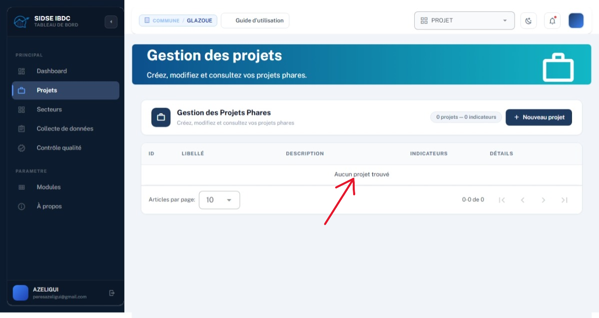

*📷 Écran « Gestion des projets » — la flèche rouge désigne le tableau de la liste des projets avec ses colonnes d'identification et de suivi.*

1. **Déclencher la création :** repérez et cliquez sur le bouton bleu foncé **« + Nouveau projet »** situé en haut à droite du répertoire.

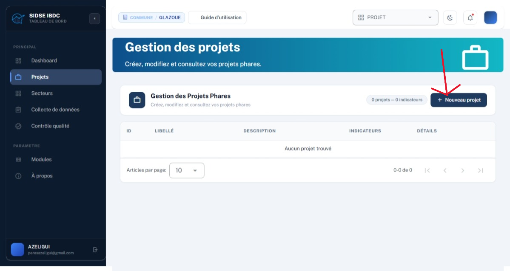

*📷 Écran « Gestion des projets » — la flèche rouge désigne l'emplacement du bouton « + Nouveau projet » pour ouvrir la boîte de dialogue de création.*

2. **Renseigner les paramètres et valider :** dans la boîte de dialogue **« Nouveau projet »**, renseignez les informations demandées :
   - **Libellé du projet :** intitulé officiel du chantier (ex. *« Réhabilitation de la piste rurale Glazoué-Thio »*).
   - **Description :** finalités, zone géographique et retombées attendues.
   - **Date de début :** date prévisionnelle de démarrage via le calendrier 📅.
   - **Statut :** état d'avancement initial (ex. *En attente*, *En cours*, *Planifié*).
3. Cliquez sur le bouton bleu **« Créer »** pour valider l'enregistrement (ou sur **« Annuler »** pour abandonner).

*📷 Boîte de dialogue « Nouveau projet » : saisie du libellé, description, calendrier et statut initial.*

> 💡 **Que faire ensuite ?**  
> Pour organiser et classifier vos projets par grands domaines d'intervention communaux, accédez à la section **Secteurs d'activité**.

---

### [Module Projets Phares] Secteurs d'activité

_Accessible depuis le menu latéral via l'onglet **« Secteurs »**, cette interface permet de gérer et de configurer la nomenclature des secteurs d'activité de la collectivité. Elle sert à classer méthodiquement chaque projet phare selon son domaine d'intervention (ex. *Infrastructures*, *Santé*, *Éducation*, *Eau & Assainissement*...)._

1. **Consulter le répertoire des secteurs :** visualisez le tableau central récapitulant les secteurs enregistrés pour la commune avec leur identifiant (ID), leur libellé et leur statut opérationnel.

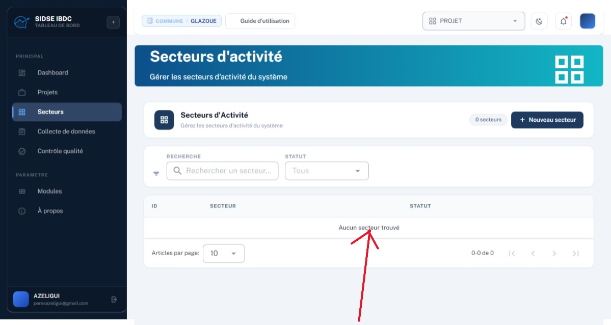

*📷 Écran « Secteurs d'activité » — la flèche rouge désigne le tableau de la liste des secteurs récapitulant les domaines d'intervention communaux.*

2. **Rechercher et filtrer les secteurs :**
   - **Recherche textuelle instantanée :** cliquez dans le champ **« RECHERCHE »** pour filtrer par mot-clé (ex. *« Eau »*, *« Santé »*).
   - **Filtre par statut :** utilisez le menu déroulant **« STATUT : Tous »** pour afficher uniquement les secteurs actifs ou inactifs.

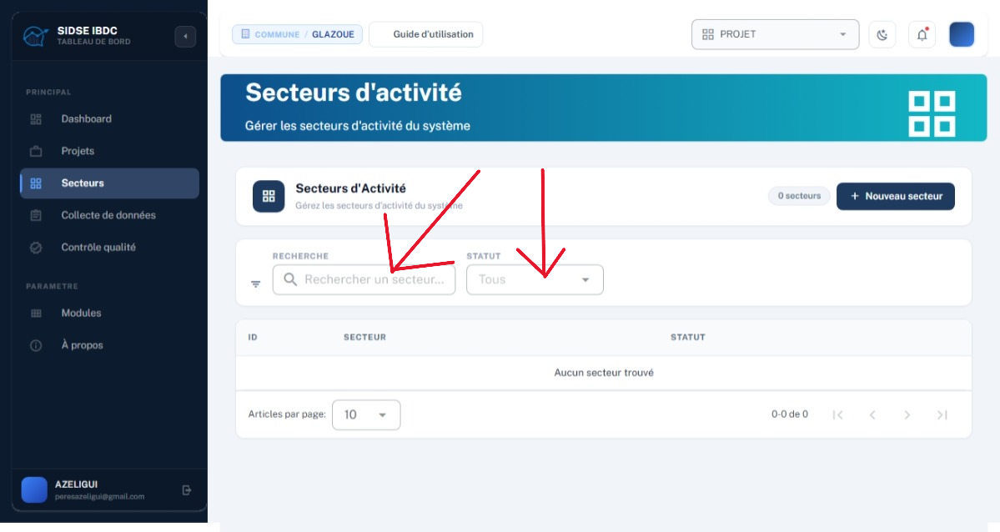

*📷 Barre de filtres — les flèches rouges mettent en évidence la recherche textuelle par mot-clé et le filtre déroulant par statut.*

3. **Ajouter un nouveau secteur d'activité :** cliquez sur le bouton bleu foncé **« + Nouveau secteur »** situé en haut à droite pour créer un domaine d'intervention supplémentaire.

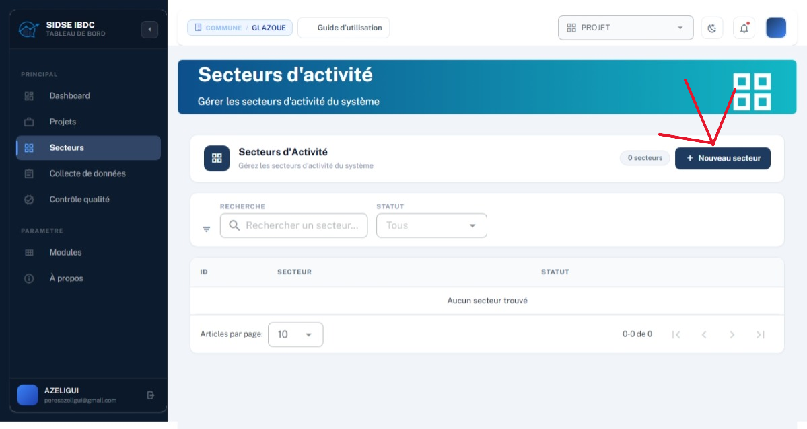

*📷 Bouton d'action — la flèche rouge indique l'emplacement du bouton « + Nouveau secteur » pour déclarer un domaine d'intervention supplémentaire.*

> 💡 **Que faire ensuite ?**  
> Une fois vos projets et secteurs configurés, accédez à la section suivante pour enregistrer les données de suivi de terrain : **Collecte de données Projets**.

---

### [Module Projets Phares] Collecte de données Projets

_Accessible via l'onglet **« Collecte de données »** du menu latéral, cette interface sert de point de saisie terrain pour renseigner les valeurs réelles des indicateurs affectés aux projets phares._

1. **Accéder à l'écran de collecte de données :** cliquez sur l'onglet **« Collecte de données »** dans le menu latéral.

*📷 Écran « Collecte de données » — interface de sélection du projet et recherche de l'indicateur à renseigner.*

2. **Filtrer par projet et rechercher un indicateur :**
   - **Filtrer par projet :** ouvrez le menu déroulant **« FILTRER PAR PROJET »** (flèche de gauche) pour sélectionner le projet concerné.
   - **Rechercher l'indicateur :** tapez le mot-clé dans la barre **« RECHERCHE : Rechercher un indicateur... »** (flèche de droite) pour filtrer les indicateurs.

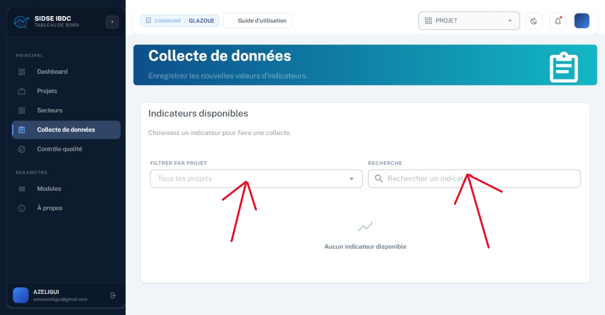

*📷 Barre de filtres — les flèches rouges mettent en évidence le menu déroulant « FILTRER PAR PROJET » (à gauche) et le champ « RECHERCHE » (à droite).*

> 💡 **Que faire ensuite ?**  
> Une fois vos données de terrain enregistrées, accédez à la section suivante : **Contrôle qualité des données**.

---

### [Module Projets Phares] Contrôle qualité des données

_Accessible depuis le menu latéral via l'onglet **« Contrôle qualité »**, cette interface constitue le filtre de vérification garantissant l'exactitude des informations collectées avant leur consolidation officielle._

1. **Consulter le tableau des vérifications en cours :** cliquez sur l'onglet **« Contrôle qualité »** dans le menu latéral.

*📷 Écran « Contrôle qualité » — tableau des vérifications en cours, statuts d'approbation et champ observation.*

2. **Filtrer les données par utilisateur, projet et indicateur :**
   - **Filtre par utilisateur :** sélectionnez un agent dans le menu déroulant **« UTILISATEUR »** (flèche de gauche).
   - **Filtre par projet :** choisissez un projet spécifique dans le menu **« PROJET »** (flèche du milieu).
   - **Filtre par indicateur :** ciblez un indicateur particulier dans le menu **« INDICATEUR »** (flèche de droite).

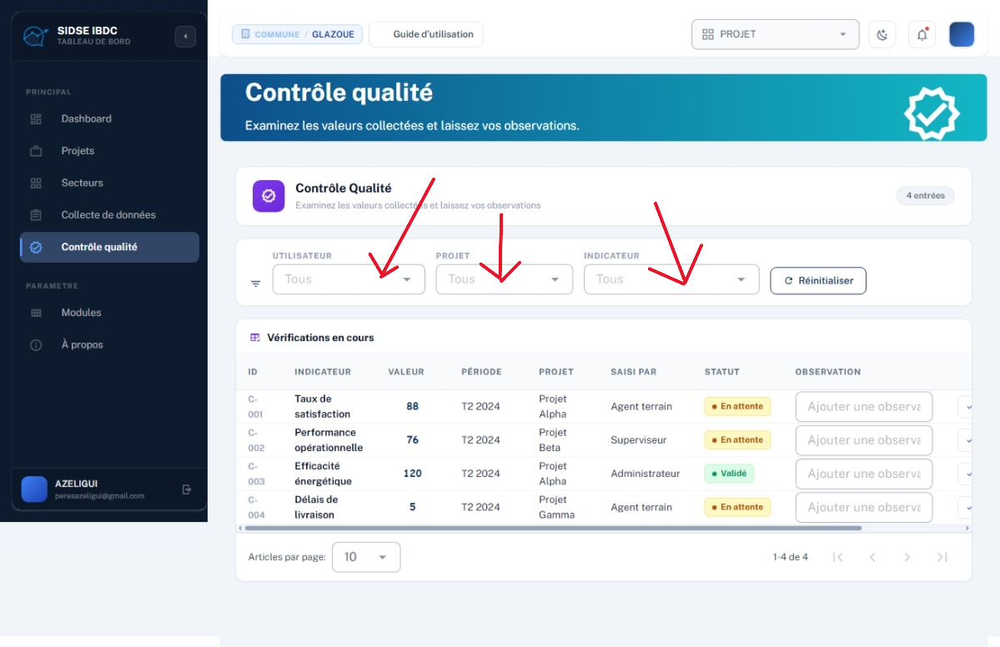

*📷 Barre de filtres — les trois flèches rouges mettent en évidence les filtres « UTILISATEUR », « PROJET » et « INDICATEUR ».*

3. **Réinitialiser les filtres d'affichage :** cliquez sur le bouton **« ⟳ Réinitialiser »** pour réafficher l'ensemble des enregistrements.

*📷 Bouton d'action — la flèche rouge indique l'emplacement du bouton « ⟳ Réinitialiser » pour réinitialiser la vue.*

4. **Valider ou rejeter les données collectées :**
   - **Bouton « ✔ Valider » :** approuver la mesure. Le statut passe à **« Validé »** (badge vert).
   - **Bouton « ✖ Rejeter » :** rejeter la donnée en cas d'erreur ou d'incohérence.

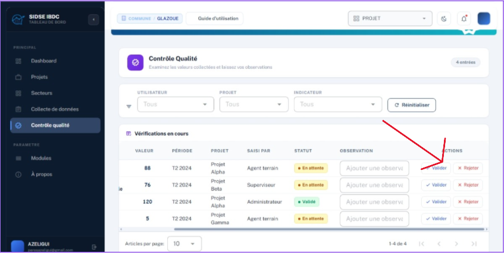

*📷 Colonne Actions — la flèche rouge indique l'emplacement des boutons « ✔ Valider » et « ✖ Rejeter » pour approuver ou rejeter une saisie.*

> 💡 **Que faire ensuite ?**  
> Retrouvez la suite des fonctionnalités de la plateforme dans les prochaines sections du guide : **Sections à venir**.

---

### [Prochainement] Sections à venir

_Ce guide sera complété au fur et à mesure avec les captures d'écran des autres modules de la plateforme. Voici les sections prévues :_

- Gestion des Recommandations : saisie, désignation des responsables et suivi des plans d'action
- Calendriers de planification : calendrier budgétaire et calendrier officiel des évaluations
- Suppression d'un compte utilisateur

---
*Documentation SIDSE IBDC (Piè Baromètre)*